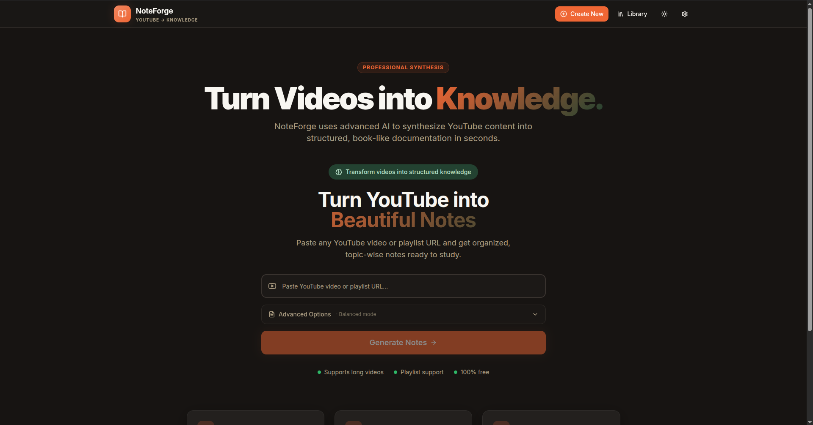
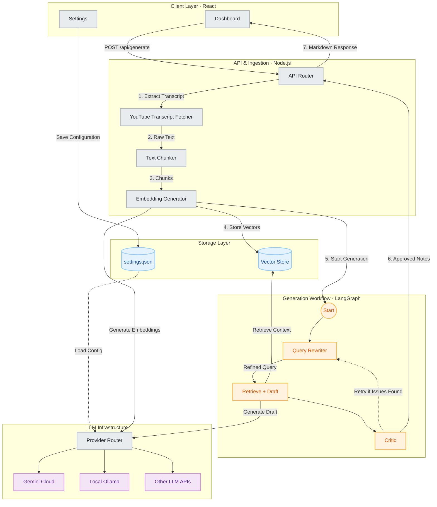

# NoteForge AI 🧠🎥

<div align="center">

**A production-ready, autonomous RAG pipeline that transforms YouTube videos into comprehensive study notes, interactive mind maps, and quizzes. Engineered with an Enterprise Hybrid LLM routing architecture to maximize speed while minimizing API costs.**

[](https://js.langchain.com/)
[](https://ollama.ai/)
[](https://reactjs.org/)
[](https://nodejs.org/)
[](https://www.prisma.io/)

</div>

<div align="center">
  
</div>

---

## 🏗 System Architecture (Phase 2)

NoteForge AI is engineered to handle massive amounts of video data by employing a highly-resilient, deterministic chunking architecture combined with a **Hybrid Multi-Key LLM Router**.



### Key Architectural Pillars

#### 1. Hybrid Multi-LLM Strategy
NoteForge splits workloads between local hardware and cloud APIs to balance speed, cost, and quality.
- **The "Heavy Lifter" (Gemini 2.5 Flash):** Reserved exclusively for heavy context synthesis. Using single-shot JSON prompts, Gemini generates Deep Study Notes, Flashcards, and Quizzes all in one highly-optimized request.
- **The "Turbo Indexer" (Ollama Local):** Used for lightweight tasks like Table of Contents generation and Mind Map restructuring, keeping cloud token usage as low as possible.

#### 2. Deterministic Timestamp Slicing
Instead of relying on computationally expensive Vector Databases (like Pinecone) to perform RAG for chapter notes, NoteForge uses **Deterministic Slicing**. By leveraging known chapter start/end timestamps, the system mathematically slices the exact lines of the transcript needed. This is 100% free, takes zero milliseconds, and guarantees perfect contextual boundaries without AI hallucinations.

#### 3. Enterprise Resilience & Next-Day Resume
Building AI applications that rely on unpredictable third-party APIs requires aggressive error handling. NoteForge is practically unbreakable:
- **Prisma & SQLite Persistence:** The entire job queue and generation state is persisted locally. If your computer shuts down or your API quota exhausts at Chapter 12 of a 15-chapter playlist, NoteForge saves the state. Tomorrow, just hit "Play" and it will resume instantly at Chapter 12.
- **Smart Key Rotation & API Pool:** The settings dashboard accepts multiple Gemini API keys. The backend manages a round-robin pool. If Key A hits a `429 RESOURCE_EXHAUSTED` error, the system flags it with an `exhaustedUntil` timestamp and seamlessly hot-swaps to Key B.
- **Adaptive Backoff Queue:** Powered by Bottleneck, the queue normally runs at full speed but immediately exponentially backs off (e.g., 4s -> 8s -> 16s cooldowns) upon detecting rate limits.

---

## 🎨 Dynamic PDF Theme Engine

Generate stunning, print-ready documents natively. The system injects runtime CSS overrides into Puppeteer to match your preferred aesthetic.
- **Modern Bento:** Sleek, glassmorphic layout.
- **Academic:** Minimalist, serif-driven, textbook styling.
- **Dark Mode:** High-contrast deep visuals.
- **Corporate:** Clean, blue-accented professional summaries.

*Code snippets and diagrams are protected by "page-break-inside: avoid" rules to ensure perfect document flow.*

---

## 🚀 Quick Start

### Prerequisites
- **Node.js** (v18 or higher)
- **Ollama** (Installed locally. Recommended: `ollama run qwen2.5-coder:7b`)
- **FFmpeg** (Required for `yt-dlp` audio extraction fallbacks)

### 1. Start the Backend (NoteForge Server)
```bash
git clone https://github.com/Sameer-Bagul/ytvideo2notes.git
cd ytvideo2notes/server

# Install dependencies
npm install

# Initialize the SQLite Database
npx prisma generate
npx prisma db push

# Start the server
npm run dev
```

### 2. Start the Frontend (React SPA)
Open a new terminal session:
```bash
cd ytvideo2notes
npm install

# Launch the Glassmorphic UI
npm run dev
```

The application will launch on `http://localhost:8080`. Go to the **Settings** panel to configure your API Key Pool and PDF Theme!

---

## 🤝 Contributing

We welcome contributions to optimize prompt templates or expand UI components.

1. Fork the repository
2. Create your feature branch (`git checkout -b feature/Optimization`)
3. Commit your changes
4. Push to the branch
5. Open a Pull Request

---

<div align="center">
<b>Transforming videos into knowledge.</b>
</div>
