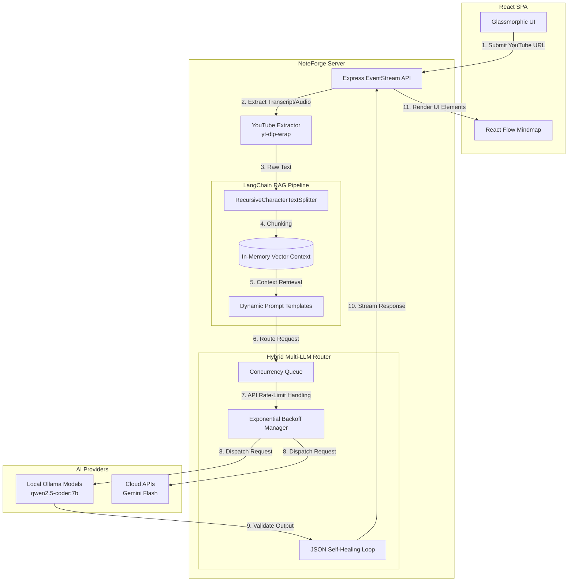

# NoteForge AI 🧠🎥

<div align="center">

**A production-ready, autonomous Retrieval-Augmented Generation (RAG) pipeline that transforms YouTube videos into comprehensive study notes, interactive mind maps, and quizzes. Engineered with a hybrid LLM routing architecture to maximize speed while minimizing API costs.**

[](https://js.langchain.com/)
[](https://ollama.ai/)
[](https://reactjs.org/)
[](https://nodejs.org/)

</div>

---

## 🏗 System Architecture

NoteForge AI is engineered to handle massive amounts of video data by employing a chunked, parallel-processing RAG architecture combined with a **Hybrid LLM Router**.



---

## 🤖 Hybrid Multi-LLM Strategy

NoteForge employs an intelligent **Task-Specific AI Provider Mapping** system that splits workloads between local hardware and cloud APIs to balance speed, cost, and quality.

### 1. The "Heavy Lifter" (Primary Model)
Used for massive text generation tasks (like summarizing a 2-hour lecture). 
* **Target:** Cloud APIs (e.g., `gemini-flash-latest`) or large local models (`qwen3:14b`).
* **Implementation:** The backend explicitly routes `generateNotesContent` requests to the primary provider, configuring high-capacity output tokens (8192+) for maximum detail.

### 2. The "Turbo Indexer" (Indexing Model)
Used for rapid, repetitive micro-tasks such as timestamp matching, topic extraction, and UI layout generation.
* **Target:** Local Ollama models (e.g., `qwen2.5-coder:7b`).
* **Implementation:** Since local inferences are free, the system fires dozens of parallel context-extraction prompts to the Turbo Indexer to build the structural data without burning through Cloud API rate limits.

---

## 🛡️ Resilience Engineering

Building AI applications that rely on unpredictable third-party APIs requires aggressive error handling. NoteForge implements three critical resilience patterns:

### Strict Concurrency Queuing
Cloud APIs (especially free tiers) instantly throw `429 Too Many Requests` if flooded. NoteForge uses `p-queue` to wrap all LLM calls. If 15 note-generation requests hit the server simultaneously, they are cleanly throttled inside a `concurrency: 10` queue, protecting the API key from blacklisting.

### Dynamic Exponential Backoff
If a cloud provider *does* return a `429` error, the backend's `executeWithBackoff` utility intercepts the failure and initiates a dynamic retry loop, waiting 5 seconds, then 15 seconds, then 45 seconds. This guarantees the user's generation job completes silently in the background without crashing.

### Auto-Healing JSON Generation
Local LLMs are notorious for outputting malformed JSON (adding markdown ticks, conversational text, or trailing commas). 
1. The server catches the raw string and attempts to run it through `jsonrepair`.
2. If `jsonrepair` fails, the **Self-Healing Loop** catches the exception.
3. It automatically re-prompts the local LLM: *"⚠️ IMPORTANT: The previous output was invalid JSON. Please produce the SAME content again, but as strictly valid JSON..."* up to 3 times until a valid syntax tree is achieved.

---

## 🚀 Quick Start

### Prerequisites
- **Node.js** (v18 or higher)
- **Ollama** (Installed locally. Recommended: `ollama run qwen2.5-coder:7b`)
- **FFmpeg** (Required for `yt-dlp` audio extraction fallbacks)

### 1. Start the Backend (NoteForge Server)
```bash
git clone https://github.com/Sameer-Bagul/ytvideo2notes.git
cd ytvideo2notes/server
npm install

# Start the LangChain Express server
npm run dev
```

### 2. Start the Frontend (React SPA)
Open a new terminal session:
```bash
cd ytvideo2notes
npm install

# Launch the Glassmorphic UI
npm run dev
```

The application will launch on `http://localhost:8080`. Go to the **Settings** panel to configure your Hybrid AI route!

---

## 🤝 Contributing

We welcome contributions to optimize prompt templates, add support for persistent vector storage (Pinecone/ChromaDB), or expand UI components.

1. Fork the repository
2. Create your feature branch (`git checkout -b feature/Optimization`)
3. Commit your changes
4. Push to the branch
5. Open a Pull Request

---

<div align="center">
<b>Transforming videos into knowledge.</b>
</div>
