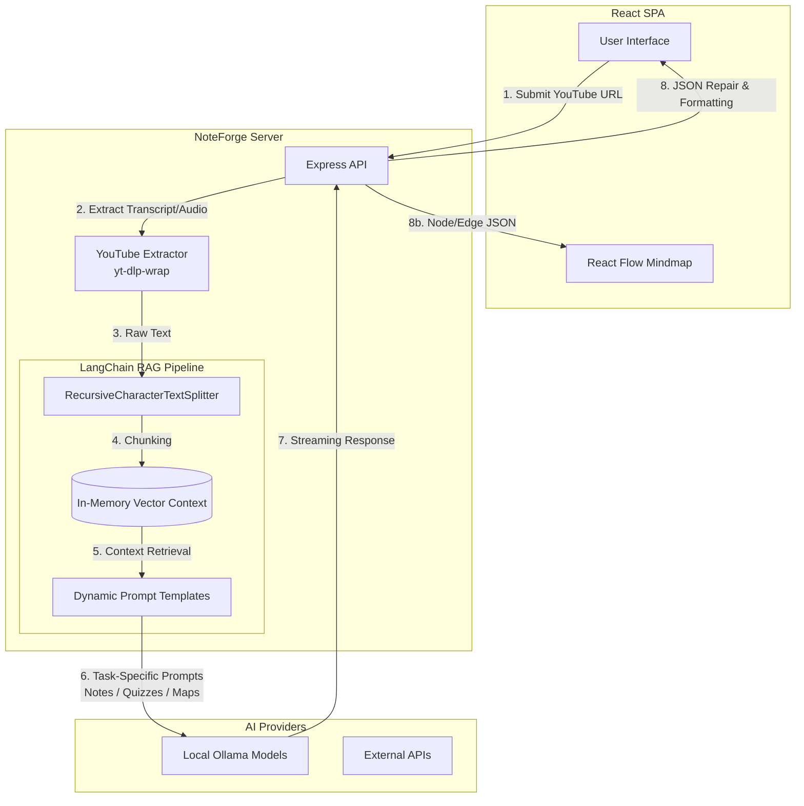

# NoteForge AI (YouTube to Notes) 🧠🎥

<div align="center">

**A high-end, completely autonomous Retrieval-Augmented Generation (RAG) pipeline that transforms YouTube videos into comprehensive study notes, interactive mind maps, and quizzes using LangChain and local Ollama models.**

[](https://js.langchain.com/)
[](https://ollama.ai/)
[](https://reactjs.org/)
[](https://nodejs.org/)
[](https://opensource.org/licenses/MIT)

[Features](#-key-features) • [RAG Architecture](#-rag-pipeline--system-architecture) • [AI Integration](#-dual-model-ai-strategy) • [Quick Start](#-quick-start)

</div>

---

## 📸 Project Media


*(Add screenshots of the generated Markdown notes, the React Flow Mind Map, and the AI Quiz generator here)*

[Watch Demo Video](assets/demo.mp4)

---

## 🎯 Key Features

✅ **Advanced RAG Pipeline** - Automatically extracts transcripts and audio from YouTube videos using `youtubei.js` and `yt-dlp-wrap`, processes them through LangChain text splitters, and generates highly accurate semantic context.  
✅ **Interactive Mind Maps** - Uses `@xyflow/react` to parse LLM-generated JSON into dynamic, drag-and-drop relationship diagrams of the video's concepts.  
✅ **Privacy-First Local AI** - Deep integration with **Ollama** allows you to run powerful models (Llama 3, Mistral) entirely locally without sending data to third-party APIs.  
✅ **Auto-Healing JSON Generation** - Utilizes `jsonrepair` to intercept and fix malformed LLM outputs, ensuring strict schema adherence for UI components like Quizzes and Mind Maps.  
✅ **Premium UI/UX** - Fully responsive glassmorphic frontend utilizing **Tailwind CSS**, **Shadcn/UI**, and **Framer Motion** for a sleek, modern learning environment.

---

## 🏗 RAG Pipeline & System Architecture

NoteForge AI is engineered to handle massive amounts of video data by employing a chunked, parallel-processing RAG architecture.



---

## 🤖 Dual-Model AI Strategy

Based on the [NoteForge Implementation Patterns](knowledge/noteforge_ai_architecture), this project employs a **Task-Specific AI Provider Mapping**:
- **Heavy Extraction Tasks** (like summarizing a 2-hour lecture): Routed to high-context models.
- **Structured Data Generation** (Mind Maps, Quizzes): Routed to highly deterministic models combined with strict system prompts to ensure valid JSON outputs.
- **Local Model Discovery**: The server automatically queries the local `http://localhost:11434/api/tags` endpoint to discover installed Ollama models, presenting them dynamically in the UI settings panel.

---

## 🚀 Quick Start

### Prerequisites
- **Node.js** (v18 or higher)
- **Ollama** (Installed locally with at least one model, e.g., `ollama run llama3`)
- **FFmpeg** (Required for `yt-dlp` audio extraction fallbacks)

### 1. Clone the Repository
```bash
git clone https://github.com/Sameer-Bagul/ytvideo2notes.git
cd ytvideo2notes
```

### 2. Start the Backend (NoteForge Server)
```bash
cd server
npm install
cp .env.example .env
# Edit .env to ensure OLLAMA_BASE_URL=http://127.0.0.1:11434

npm run dev
```
*The LangChain Express server will boot up and automatically scan for local AI models.*

### 3. Start the Frontend (Vite/React)
Open a new terminal session:
```bash
# Return to root directory
npm install
npm run dev
```
*The application will launch on `http://localhost:5173`. Drop a YouTube link in the search bar and watch the RAG pipeline go to work!*

---

## 🤝 Contributing

We welcome contributions to optimize prompt templates, add support for Pinecone/ChromaDB for persistent vector storage, or expand UI components.
1. Fork the repository
2. Create your feature branch (`git checkout -b feature/VectorDB`)
3. Commit your changes
4. Push to the branch
5. Open a Pull Request

---

## 📝 License

This project is licensed under the MIT License.

<div align="center">
<b>Transforming videos into knowledge.</b>
</div>
